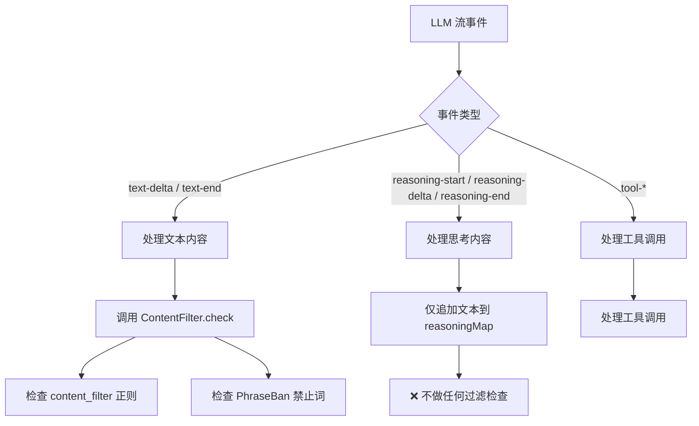

# Content Filter 与 Reasoning/Thinking 内容检查分析

## 结论

**是的，当前的禁用词命令（`ban`）和内容过滤器（`content_filter`）完全不检查思考内容（reasoning/thinking）。**

## 代码分析

### 1. 唯一检查点：`text-end` 事件

`ContentFilter.check()` 在代码中只被调用了一次：

[`packages/opencode/src/session/processor.ts:671-677`](packages/opencode/src/session/processor.ts)

```ts
if (!ctx.assistantMessage.summary) {
  const cfg = yield* config.get()
  const filterCfg = cfg.content_filter
  if (filterCfg && ctx.currentText.text.trim()) {
    yield* ContentFilter.check(ctx.currentText.text, filterCfg, ctx.sessionID)
  }
}
```

这个调用位于 `text-end` 事件的处理分支中 —— 即当模型的**可见文本**部分完成输出时触发。

### 2. `ContentFilter.check()` 内部逻辑

[`packages/opencode/src/content-filter/filter.ts:39-68`](packages/opencode/src/content-filter/filter.ts)

```ts
export const check = (text: string, config: Config, sessionID: SessionID) =>
  Effect.gen(function* () {
    // 1. 检查 content_filter 配置中定义的正则模式
    if (config.patterns) {
      for (const pattern of config.patterns) {
        if (!tryMatch(pattern.regex, text)) continue
        // ... warn / block / retry
      }
    }

    // 2. 检查通过 ban 命令添加的禁止词
    const banned = yield* PhraseBan.check(sessionID, text)
    if (banned) {
      return yield* new BlockedError({ ... })
    }
  })
```

该函数检查两样东西：
- `content_filter` 配置中的正则模式（用户显式配置）
- `PhraseBan` 系统中通过 `/ban` 命令添加的短语

### 3. Reasoning/Thinking 事件处理（**无过滤**）

[`packages/opencode/src/session/processor.ts:308-349`](packages/opencode/src/session/processor.ts)

```ts
case "reasoning-start":
  // 仅初始化 reasoningMap，无过滤检查
  ctx.reasoningMap[value.id] = { type: "reasoning", text: "", ... }
  return

case "reasoning-delta":
  // 仅追加文本，无过滤检查
  ctx.reasoningMap[value.id].text += value.text
  return

case "reasoning-end":
  // 仅结束 reasoning 片段，无过滤检查
  yield* finishReasoning(value.id)
  return
```

Reasoning 内容的处理流程中，**没有任何对 `ContentFilter.check()` 或 `PhraseBan.check()` 的调用**。

### 4. `PhraseBan.check()` 也只被 `ContentFilter.check()` 调用

[`packages/opencode/src/content-filter/phrase-ban.ts:83`](packages/opencode/src/content-filter/phrase-ban.ts)

搜索结果显示，`PhraseBan.check()` 只在一个地方被调用 —— 即上面提到的 `ContentFilter.check()` 内部。这意味着推理链路上完全没有禁止词检查。

## 流程图



## 影响

- **禁止词命令（`/ban` 命令）**：仅检查 assistant 的可见文本输出，不检查 reasoning/thinking 内容。
- **`content_filter` 配置**：同样仅检查可见文本，不检查思考内容。
- **用户可以通过 `/ban` 添加禁止词**，但如果模型将违规内容放在 thinking/reasoning 块中（而不是可见文本中），则不会被拦截。
- **注意**：这可能是设计上的权衡 —— 思考内容通常不被用户直接看到（在 TUI 中默认隐藏），但取决于产品策略，是否需要对 reasoning 内容进行过滤需要进一步讨论。
