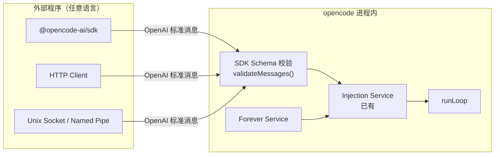

# 外部编程 API 通路实现规格

## 设计原则

外部动态注入的核心是**复用已有的 Injection Service**（[`packages/opencode/src/session/injection.ts`](packages/opencode/src/session/injection.ts)），通过以下三种通路暴露给外部程序。

### 重点：支持标准 OpenAI 消息格式

外部注入的消息必须采用 OpenAI 标准的 Chat Completion 消息格式（role/content/tool_calls），而不是简化格式。这带来以下优势：

1. **标准化** — 任何语言的 OpenAI SDK 使用者都能立即理解
2. **多角色** — 支持 system/user/assistant/tool 全角色注入
3. **多模态** — content 支持 text/image/text_url 数组
4. **工具调用** — 可以注入 assistant 消息中的 tool_calls，或 tool 角色的结果消息
5. **兼容现有生态** — 现有的 prompt 工程工具和模板可直接复用



- **消息格式校验由 SDK 端负责**，server 端只做透传和转换
- SDK 校验通过后才会发送给 server，减少无效请求
- SDK 测试覆盖全部消息类型的校验

---

## 通路 1：通过 SDK（推荐）

### SDK 新增方法

在 `@opencode-ai/sdk` 的 session client 中新增：

```typescript
// @opencode-ai/sdk

export interface SessionClient {
  // ... 现有方法 ...

  /**
   * 向指定 session 注入消息序列。
   * @param messages OpenAI 标准 Chat Completion 消息数组
   * @param options.mode 注入位置：prefix（前缀）/ suffix（后缀，默认）
   *
   * 消息格式遵循 OpenAI API：
   * https://platform.openai.com/docs/api-reference/chat/create
   *
   * SDK 会在发送前校验消息格式，确保 role/content/tool_calls 等的合法性。
   */
  inject(
    sessionID: string,
    messages: OpenAIMessage[],
    options?: {
      mode?: "prefix" | "suffix"
    },
  ): Promise<void>

  /**
   * 注册轮次完成回调。
   */
  onRoundComplete(
    sessionID: string,
    callback: (ctx: {
      round: number
      finish: string | undefined
      toolCalls: Array<{ tool: string; callID: string }>
    }) => Promise<{ action: "inject" | "continue" | "stop"; messages?: OpenAIMessage[] }>,
  ): Promise<void>

  /**
   * 查询永续模式状态
   */
  getForeverStatus(sessionID: string): Promise<{
    enabled: boolean
    paused: boolean
    pauseReason?: string
    resumeCondition?: string
    rounds: number
    costUsd: number
  }>
}
```

---

### OpenAI 消息类型定义（SDK 中）

```typescript
// @opencode-ai/sdk/src/forever-inject.ts

// 参考 OpenAI Chat Completion 消息格式
// https://platform.openai.com/docs/api-reference/chat/create#chat-create-messages

export type OpenAIMessage =
  | OpenAISystemMessage
  | OpenAIUserMessage
  | OpenAIAssistantMessage
  | OpenAIToolMessage

export interface OpenAISystemMessage {
  role: "system"
  content: string
  name?: string
}

export interface OpenAIUserMessage {
  role: "user"
  content: string | OpenAIUserContent[]
  name?: string
}

export interface OpenAIUserContent {
  type: "text" | "image_url"
  text?: string
  image_url?: { url: string; detail?: "auto" | "low" | "high" }
}

export interface OpenAIAssistantMessage {
  role: "assistant"
  content?: string | null
  name?: string
  tool_calls?: OpenAIToolCall[]
  /** 仅用于 refusal */
  refusal?: string | null
}

export interface OpenAIToolCall {
  id: string
  type: "function"
  function: { name: string; arguments: string }
}

export interface OpenAIToolMessage {
  role: "tool"
  content: string
  tool_call_id: string
}

// 注入请求格式
export interface InjectRequest {
  messages: OpenAIMessage[]
  mode?: "prefix" | "suffix"
  sessionID?: string
}
```

---

### SDK 消息校验实现

```typescript
// @opencode-ai/sdk/src/forever-inject.ts

import { z } from "zod"

const OpenAIMessageSchema: z.ZodType<OpenAIMessage> = z.discriminatedUnion("role", [
  z.object({
    role: z.literal("system"),
    content: z.string(),
    name: z.string().optional(),
  }),
  z.object({
    role: z.literal("user"),
    content: z.union([
      z.string(),
      z.array(z.object({
        type: z.enum(["text", "image_url"]),
        text: z.string().optional(),
        image_url: z.object({
          url: z.string(),
          detail: z.enum(["auto", "low", "high"]).optional(),
        }).optional(),
      })),
    ]),
    name: z.string().optional(),
  }),
  z.object({
    role: z.literal("assistant"),
    content: z.string().nullable().optional(),
    name: z.string().optional(),
    tool_calls: z.array(z.object({
      id: z.string(),
      type: z.literal("function"),
      function: z.object({ name: z.string(), arguments: z.string() }),
    })).optional(),
    refusal: z.string().nullable().optional(),
  }),
  z.object({
    role: z.literal("tool"),
    content: z.string(),
    tool_call_id: z.string(),
  }),
])

/**
 * 校验并规范化 OpenAI 消息序列。
 *
 * 校验规则：
 * 1. 每条消息的 role 必须是 system/user/assistant/tool 之一
 * 2. 每字段符合对应 role 的要求
 * 3. 消息序列不能以 tool 消息开头
 * 4. tool 消息必须跟在 assistant 消息之后
 * 5. assistant 如果有 tool_calls，不能同时有 content
 *
 * @throws 如果校验失败
 */
export function validateMessages(messages: unknown): OpenAIMessage[] {
  const result = z.array(OpenAIMessageSchema).safeParse(messages)
  if (!result.success) {
    throw new TypeError(
      `Forever inject 消息格式校验失败: ${result.error.message}` +
      "\n消息必须遵循 OpenAI Chat Completion 格式。"
    )
  }

  const validRoles = new Set(["system", "user", "assistant", "tool"])

  for (let i = 0; i < result.data.length; i++) {
    const curr = result.data[i]

    if (!validRoles.has(curr.role)) {
      throw new TypeError(`消息序列中第 ${i + 1} 条 role 非法: "${curr.role}"`)
    }

    // 第一条消息不能是 tool
    if (i === 0 && curr.role === "tool") {
      throw new TypeError("消息序列不能以 tool 消息开头")
    }

    // assistant 不能同时有 content 和 tool_calls
    if (curr.role === "assistant" && curr.content && curr.tool_calls && curr.tool_calls.length > 0) {
      throw new TypeError(`第 ${i + 1} 条：assistant 消息不能同时包含 content 和 tool_calls`)
    }

    // tool 消息必须有前置 assistant
    if (curr.role === "tool") {
      const prev = result.data[i - 1]
      if (!prev || prev.role !== "assistant") {
        throw new TypeError(
          `第 ${i + 1} 条：tool 角色消息必须在 assistant 消息之后` +
          `（前一条 role: ${prev?.role ?? "none"}）`
        )
      }
      // 前置 assistant 必须有对应的 tool_calls
      if (!prev.tool_calls?.some(tc => tc.id === curr.tool_call_id)) {
        throw new TypeError(
          `第 ${i + 1} 条：tool_call_id "${curr.tool_call_id}" 未在前置 assistant 消息的 tool_calls 中找到`
        )
      }
    }
  }

  return result.data
}
```

---

### SDK 测试用例

```typescript
// @opencode-ai/sdk/test/forever-inject.test.ts

import { describe, it, expect } from "bun:test"
import { validateMessages } from "../src/forever-inject"

describe("validateMessages（OpenAI 标准消息格式）", () => {

  describe("合法序列", () => {
    it("接受单条 user 消息", () => {
      const msgs = validateMessages([
        { role: "user", content: "你好" },
      ])
      expect(msgs).toHaveLength(1)
    })

    it("接受 system + user 序列", () => {
      const msgs = validateMessages([
        { role: "system", content: "你是知乎优秀答主" },
        { role: "user", content: "请回答问题" },
      ])
      expect(msgs).toHaveLength(2)
    })

    it("接受 assistant（仅 tool_calls）+ tool 序列", () => {
      const msgs = validateMessages([
        {
          role: "assistant",
          content: null,
          tool_calls: [{
            id: "call_1",
            type: "function",
            function: { name: "search", arguments: '{"q":"AI"}' },
          }],
        },
        { role: "tool", content: '{"results":[]}', tool_call_id: "call_1" },
      ])
      expect(msgs).toHaveLength(2)
    })

    it("接受完整多轮对话", () => {
      const msgs = validateMessages([
        { role: "system", content: "助手" },
        { role: "user", content: "搜索AI" },
        {
          role: "assistant",
          tool_calls: [{
            id: "call_1", type: "function",
            function: { name: "websearch", arguments: '{"q":"AI 2026"}' },
          }],
        },
        { role: "tool", content: "结果内容", tool_call_id: "call_1" },
        { role: "assistant", content: "以下是搜索结果..." },
        { role: "user", content: "继续" },
      ])
      expect(msgs).toHaveLength(6)
    })

    it("接受多模态 user 消息（text + image_url）", () => {
      const msgs = validateMessages([{
        role: "user",
        content: [
          { type: "text", text: "分析这张图" },
          { type: "image_url", image_url: { url: "https://example.com/img.png", detail: "auto" } },
        ],
      }])
      expect(msgs).toHaveLength(1)
    })

    it("接受 assistant 的 refusal 字段", () => {
      const msgs = validateMessages([
        { role: "assistant", content: null, refusal: "无法回答" },
      ])
      expect(msgs).toHaveLength(1)
    })
  })

  describe("非法序列", () => {
    it("拒绝未知 role", () => {
      expect(() => validateMessages([
        { role: "unknown", content: "test" },
      ])).toThrow("消息格式校验失败")
    })

    it("拒绝以 tool 开头的序列", () => {
      expect(() => validateMessages([
        { role: "tool", content: "测试", tool_call_id: "c1" },
      ])).toThrow("不能以 tool 消息开头")
    })

    it("拒绝 tool 没有前置 assistant", () => {
      expect(() => validateMessages([
        { role: "user", content: "hi" },
        { role: "tool", content: "结果", tool_call_id: "c1" },
      ])).toThrow("必须在 assistant 消息之后")
    })

    it("拒绝 tool_call_id 不匹配", () => {
      expect(() => validateMessages([
        {
          role: "assistant",
          tool_calls: [{ id: "call_a", type: "function", function: { name: "x", arguments: "{}" } }],
        },
        { role: "tool", content: "结果", tool_call_id: "call_b" },
      ])).toThrow("未在前置 assistant 消息的 tool_calls 中找到")
    })

    it("拒绝 assistant 同时有 content 和 tool_calls", () => {
      expect(() => validateMessages([{
        role: "assistant",
        content: "文字",
        tool_calls: [{ id: "c1", type: "function", function: { name: "x", arguments: "{}" } }],
      }])).toThrow("不能同时包含 content 和 tool_calls")
    })

    it("拒绝缺少必填字段", () => {
      // @ts-expect-error 测试非法输入
      expect(() => validateMessages([
        { role: "tool", content: "结果" },
      ])).toThrow()
    })

    it("拒绝空数组", () => {
      expect(() => validateMessages([])).toThrow()
    })
  })
})
```

---

### HTTP API 端点

SDK 内部通过以下 HTTP 端点与 opencode server 通信：

```
POST   /api/sessions/{sessionID}/inject          → 注入消息序列
POST   /api/sessions/{sessionID}/round-handler    → 注册轮次回调
GET    /api/sessions/{sessionID}/forever-status   → 查询永续状态
```

### 请求/响应示例

```bash
# 注入单条 user 消息（最常见场景）
curl -X POST http://localhost:4096/api/sessions/abc123/inject \
  -H "Content-Type: application/json" \
  -d '{
    "mode": "suffix",
    "messages": [
      {
        "role": "user",
        "content": "请回答知乎问题：《如何评价2026年的AI发展？》\n请从技术、产业、社会三个维度给出专业分析。"
      }
    ]
  }'
# → 200 { "ok": true }

# 注入多轮上下文（含 system + 多轮对话）
curl -X POST http://localhost:4096/api/sessions/abc123/inject \
  -H "Content-Type: application/json" \
  -d '{
    "mode": "prefix",
    "messages": [
      {
        "role": "system",
        "content": "你现在是一个知乎优秀答主，擅长技术领域深度分析。基于搜索结果给出专业回答。"
      },
      {
        "role": "user",
        "content": [
          { "type": "text", "text": "请分析以下架构图：" },
          { "type": "image_url", "image_url": { "url": "https://zhihu.com/pic/xxx.png" } }
        ]
      }
    ]
  }'
# → 200 { "ok": true }

# 注入 assistant + tool 序列（用于注入已完成的搜索结果）
curl -X POST http://localhost:4096/api/sessions/abc123/inject \
  -H "Content-Type: application/json" \
  -d '{
    "mode": "prefix",
    "messages": [
      {
        "role": "assistant",
        "tool_calls": [{
          "id": "prefetch_1",
          "type": "function",
          "function": { "name": "websearch", "arguments": "{\"q\":\"2026 AI\"}" }
        }]
      },
      {
        "role": "tool",
        "content": "搜索结果...",
        "tool_call_id": "prefetch_1"
      }
    ]
  }'
# → 200 { "ok": true }

# 查询永续模式状态
curl http://localhost:4096/api/sessions/abc123/forever-status
# → 200 {
#   "enabled": true,
#   "paused": true,
#   "pauseReason": "等待新问题",
#   "resumeCondition": "file_change",
#   "rounds": 42,
#   "costUsd": 0.15
# }
```

---

### 注入流程：SDK 校验 → Server → InjectionService

```mermaid
sequenceDiagram
    participant Ext as 外部程序
    participant SDK as @opencode-ai/sdk
    participant Server as opencode HTTP Server
    participant Inject as Injection Service
    participant Loop as runLoop

    Ext->>SDK: inject(sid, messages, { mode })
    SDK->>SDK: validateMessages(messages)
    Note over SDK: 使用 zod schema 校验格式
    Note over SDK: 校验通过后发送
    SDK->>Server: POST /api/sessions/{sid}/inject
    Server->>Server: OpenAI 消息 → InjectionPart[]
    Server->>Inject: setSuffix(sessionID, parts)
    Inject-->>Server: ok
    Server-->>SDK: 200 { ok: true }
    SDK-->>Ext: 返回成功

    Note over Loop: 当前 LLM 轮次完成后
    Loop->>Inject: consumeSuffix(sessionID)
    Inject-->>Loop: parts
    Loop->>Loop: 将注入消息加入 message 队列
    Loop->>LLM: 发给 LLM
```

---

### Server 端的消息转换

```typescript
// packages/opencode/src/forever/inject-handler.ts

import { type OpenAIMessage } from "@opencode-ai/sdk"
import { type InjectionPart } from "@/session/injection"

/**
 * 将 OpenAI 标准消息转为 InjectionPart 数组。
 *
 * 转换规则：
 * - system → <system>标签包裹，保持上下文
 * - user → 直接提取文本或拼接 content 数组
 * - assistant → 转为 <context> 参考消息（不包含 tool_calls）
 * - tool → <tool-result> 标签包裹
 *
 * 多条消息可以构建 multi-turn context 供 LLM 参考。
 */
export function openAIMessagesToInjectionParts(
  messages: OpenAIMessage[],
): InjectionPart[] {
  const parts: InjectionPart[] = []

  for (const msg of messages) {
    switch (msg.role) {
      case "system":
        parts.push({
          type: "text",
          text: `<system>\n${msg.content}\n</system>`,
          synthetic: true,
        })
        break

      case "user": {
        const content = typeof msg.content === "string"
          ? msg.content
          : msg.content
            .filter(c => c.type === "text")
            .map(c => c.text)
            .join("\n")
        parts.push({ type: "text", text: content, synthetic: true })
        break
      }

      case "assistant":
        if (msg.content) {
          parts.push({
            type: "text",
            text: `<context>\n${msg.content}\n</context>`,
            synthetic: true,
          })
        }
        // 工具调用信息保留为元数据（主要注入 agent 上下文）
        if (msg.tool_calls) {
          for (const tc of msg.tool_calls) {
            parts.push({
              type: "text",
              text: `<tool-call id="${tc.id}">${tc.function.name}(${tc.function.arguments})</tool-call>`,
              synthetic: true,
            })
          }
        }
        break

      case "tool":
        parts.push({
          type: "text",
          text: `<tool-result id="${msg.tool_call_id}">\n${msg.content}\n</tool-result>`,
          synthetic: true,
        })
        break
    }
  }

  return parts
}
```

---

## 通路 2：本地 IPC（可选高级方案）

当 opencode 以 TUI 模式运行时，可通过 Unix Socket（Linux/macOS）或 Named Pipe（Windows）暴露编程接口。

### IPC 消息协议（同样使用 OpenAI 标准消息）

```typescript
// 外部 → opencode
type IpcRequest =
  | {
      type: "inject"
      sessionID: string
      messages: OpenAIMessage[]    // ← OpenAI 标准格式
      mode?: "prefix" | "suffix"
    }
  | { type: "set_round_handler"; sessionID: string }
  | { type: "get_forever_status"; sessionID: string }
  | { type: "clear"; sessionID: string }

// opencode → 外部
type IpcResponse =
  | { type: "ok" }
  | {
      type: "forever_status"
      enabled: boolean
      paused: boolean
      pauseReason?: string
      rounds: number
      costUsd: number
    }
  | {
      type: "round_complete"
      round: number
      finish: string | undefined
      toolCalls: Array<{ tool: string; callID: string }>
    }
  | { type: "error"; message: string }
```

### IPC Server 实现骨架

```typescript
// packages/opencode/src/forever/ipc.ts

import { createServer, type Socket } from "net"
import { Effect } from "effect"
import { type OpenAIMessage, validateMessages } from "@opencode-ai/sdk"
import { openAIMessagesToInjectionParts } from "./inject-handler"

export class ForeverIPCServer {
  private server: ReturnType<typeof createServer> | null = null
  private path: string

  constructor(path: string) {
    this.path = path
  }

  start(injection: Injection.Interface): Effect.Effect<void> {
    return Effect.async((resume) => {
      this.server = createServer((socket: Socket) => {
        let buffer = ""
        socket.on("data", (chunk) => {
          buffer += chunk.toString()
          const lines = buffer.split("\n")
          buffer = lines.pop() ?? ""
          for (const line of lines) {
            if (!line.trim()) continue
            try {
              const req: IpcRequest = JSON.parse(line)
              this.handle(req, socket, injection)
            } catch (e) {
              socket.write(JSON.stringify({ type: "error", message: "Invalid JSON" }) + "\n")
            }
          }
        })
      })
      this.server.listen(this.path, () => resume(Effect.void))
    })
  }

  private handle(req: IpcRequest, socket: Socket, injection: Injection.Interface) {
    switch (req.type) {
      case "inject": {
        try {
          // 同样使用 SDK 的 validateMessages 进行校验
          const valid = validateMessages(req.messages)
          const parts = openAIMessagesToInjectionParts(valid)
          Effect.runFork(
            injection.setSuffixOnce(req.sessionID, parts),
          )
          socket.write(JSON.stringify({ type: "ok" }) + "\n")
        } catch (e) {
          socket.write(JSON.stringify({ type: "error", message: (e as Error).message }) + "\n")
        }
        break
      }
      // ... 其他处理
    }
  }

  stop(): Effect.Effect<void> {
    return Effect.async((resume) => {
      this.server?.close(() => resume(Effect.void))
    })
  }
}
```

---

## 通路 3：环境变量/文件协议

参考进化模式的 `.evolve-msg.txt` 文件协议，永续模式也支持简易的文件级通信：

```bash
# 外部程序写入包含 OpenAI 消息序列的文件
cat > $S_CODE_TEMP/.forever-inject-{sessionID}.json << 'EOF'
{
  "messages": [
    { "role": "user", "content": "请回答知乎问题：如何评价2026年的AI发展？" }
  ]
}
EOF
```

opencode 的 `loop()` 函数在启动时检查此文件并解析/注入。

但**设计文档推荐使用编程 API（通路 1/2）**，因为文件协议缺乏双向通信能力和校验。

---

## 与已有 Injection Service 的映射

| 外部 API（OpenAI 消息格式） | Injection Service 内部方法 | 说明 |
|----------------------------|--------------------------|------|
| `inject(sid, msgs, { mode: "prefix" })` | `setPrefix(sid, parts)` | 注入为前缀，在下一轮 LLM 调用前生效 |
| `inject(sid, msgs, { mode: "suffix" })` | `setSuffix(sid, parts)` | 注入为后缀，在每轮 LLM 响应后生效 |
| `onRoundComplete(sid, cb)` | `onRoundComplete(sid, handler)` | 注册轮次回调，返回 OpenAI 消息 |
| `clear(sid)` | `clear(sid)` | 清除所有注入 |

---

## 知乎问答 Agent 场景示例

```python
# 外部 Python 程序：知乎监控脚本
import requests
import json
import time

OPENCODE_URL = "http://localhost:4096"
SESSION_ID = "zhihu-qa-session"

def check_new_questions():
    questions = fetch_zhihu_questions()  # 用知乎 API 获取

    for q in questions:
        # 使用 OpenAI 标准消息格式注入
        response = requests.post(
            f"{OPENCODE_URL}/api/sessions/{SESSION_ID}/inject",
            json={
                "mode": "suffix",
                "messages": [
                    {
                        "role": "system",
                        "content": "你是一个知乎优秀答主。用中文给出专业、结构化的回答。引用来源。"
                    },
                    {
                        "role": "user",
                        "content": f"请回答知乎问题：{q['title']}\n"
                                   f"问题链接：{q['url']}\n"
                                   f"问题描述：{q['detail']}"
                    }
                ],
            },
        )
        if response.status_code == 200:
            print(f"Injected: {q['title']}")
        else:
            print(f"Failed: {response.json()}")

        time.sleep(60)  # 等待处理

while True:
    check_new_questions()
    time.sleep(300)  # 5 分钟轮询
```

### SDK 端校验 + 注入示例

```typescript
// 外部 Node.js 程序
import { createOpencodeClient } from "@opencode-ai/sdk"

const client = createOpencodeClient({
  baseUrl: "http://localhost:4096",
  directory: "/project",
})

async function onNewQuestion(title: string, detail: string) {
  await client.session.inject(
    "zhihu-qa-session",
    [
      { role: "system", content: "你是一个知乎技术答主。" },
      { role: "user", content: `请回答：${title}\n\n${detail}` },
    ],
    { mode: "suffix" },
  )
  // SDK 内部会自动调用 validateMessages() 校验格式
  // 校验不通过会抛出 TypeError，不会发送请求
  console.log("Injected successfully")
}

// 支持的更多场景
await client.session.inject(sid, [
  { role: "user", content: [
    { type: "text", text: "分析这个架构：" },
    { type: "image_url", image_url: { url: "https://example.com/diag.png" } },
  ]},
])

await client.session.inject(sid, [
  {
    role: "assistant",
    tool_calls: [{ id: "pre_1", type: "function", function: { name: "websearch", arguments: '{"q":"AI"}' } }],
  },
  { role: "tool", content: "搜索结果...", tool_call_id: "pre_1" },
])
```
