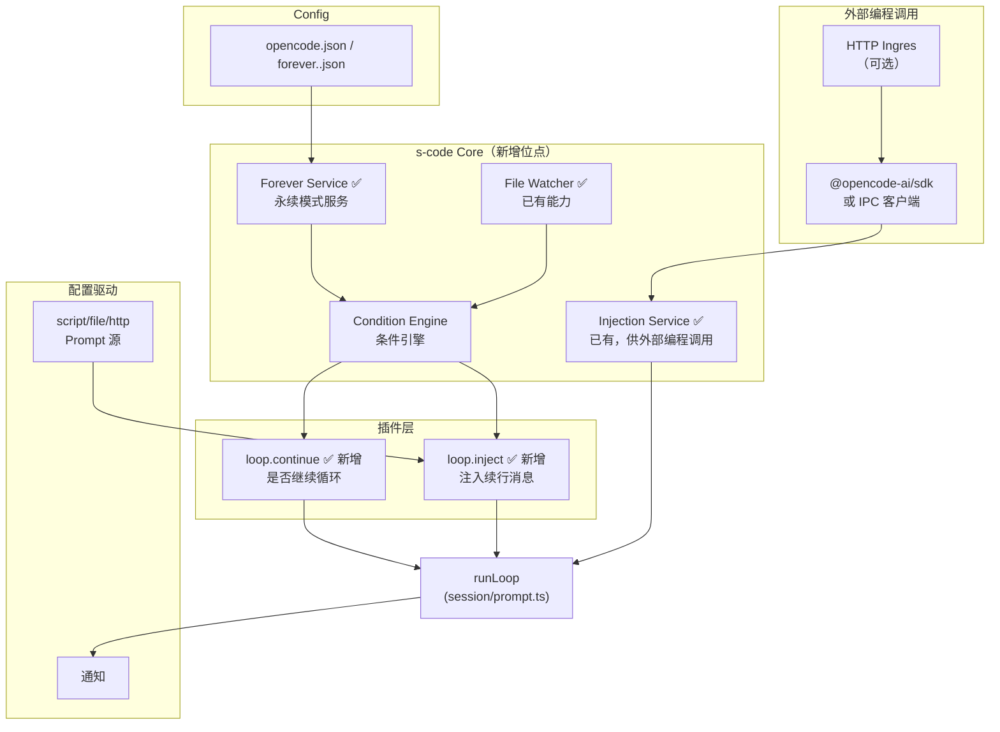

# 永续模式（Forever Mode）详细设计 v2

## 1. 概述

永续模式是一种让 Agent 在无人值守情况下持续运行的机制。  
它复用了进化模式的"自动续行"骨架，但在以下方面做了泛化：

| 维度 | 进化模式 | 永续模式 |
|------|---------|---------|
| 触发条件 | 仅 `isEvolveMode()` | 可配置条件（文件变化/定时/外部Webhook） |
| 退出工具 | `evolve()` 硬编码 | 可配置工具名 + 自定义行为 |
| 续行提示词 | 固定 system-reminder | 可通过外部编程 API + Plugin Hook 动态注入 |
| 外部控制 | 无（仅文件协议 .evolve-msg.txt） | 编程 API（Injection Service + 自定义 adapter） |
| 监听 | 无 | 内置文件监听 + 条件引擎 |

---

## 2. 架构总览



---

## 3. 设计目标

1. **零核心侵入** — 核心 loop 只增加 2~3 个条件检测点，所有行为逻辑委托给 Plugin Hook
2. **工具可配置** — 永续退出工具名在配置中声明，可动态注入到 tool registry
3. **条件可组合** — "文件变化后恢复"、"达到 N 轮后暂停"等条件可自由组合
4. **提示词可外部注入** — 支持从文件/HTTP/脚本动态读取续行 prompt
5. **向下兼容** — 不影响现有 session 流程，非永续模式性能零损耗

---

## 4. 新增 Plugin Hook 定义

在 [`packages/plugin/src/index.ts`](packages/plugin/src/index.ts:222-335) 的 `Hooks` 接口中新增 3 个 Hook：

### 4.1 `loop.continue`

```typescript
/**
 * 决定 session 循环是否应继续。
 * - 返回 { shouldContinue: true } → 继续下一轮
 * - 返回 { shouldContinue: false, reason: "..." } → 跳出循环（idle或sleep）
 * - 返回 { shouldContinue: true, sleepMs: 5000 } → 等待后继续
 */
"loop.continue"?: (
  input: {
    sessionID: string
    round: number                    // 当前轮次
    lastFinish: string | undefined   // LLM finish reason
    hasToolCalls: boolean
    isForeverMode: boolean           // 是否为永续模式
    conditionState?: Record<string, unknown>  // 条件引擎状态
  },
  output: {
    shouldContinue: boolean
    reason?: string         // 用于日志和通知
    sleepMs?: number        // 等待毫秒后继续（用于定时轮询）
    conditionState?: Record<string, unknown>  // 回写条件状态
  },
) => Promise<void>
```

### 4.2 `loop.inject`

```typescript
/**
 * 在继续循环前注入用户消息（替代进化模式的硬编码 system-reminder）。
 * - 返回 parts 将被注入为合成 user message
 * - parts 为空数组则不注入（循环仍继续，但不加新消息）
 */
"loop.inject"?: (
  input: {
    sessionID: string
    round: number
    lastFinish: string | undefined
    isForeverMode: boolean
    conditionState?: Record<string, unknown>
  },
  output: {
    parts: Array<{ type: "text"; text: string; synthetic?: boolean }>
  },
) => Promise<void>
```

### 4.3 `tool.definition`（增强已有 Hook）

```typescript
/**
 * 在 LLM 调用前，允许插件注入/修改工具定义。
 * 已存在（只读），但现在允许新增工具。
 * 永续模式用此 Hook 注入可配置的退出工具。
 */
"tool.definition"?: (
  input: { toolID: string },
  output: {
    description: string
    parameters: any
    /** 新增：允许插件注册全新工具 */
    add?: Record<string, { description: string; parameters: any }>
  },
) => Promise<void>
```

---

## 5. 配置层设计

在 `opencode.json` 中新增加 `forever` 配置段（可选）：

```jsonc
{
  "forever": {
    "enabled": false,
    // 退出/控制工具名
    "tool": "forever_sleep",
    // 工具描述
    "tool_description": "暂停永续模式，保留状态以便恢复",
    // 工具参数 schema（自动转为 JSON Schema）
    "tool_parameters": {
      "type": "object",
      "properties": {
        "reason": { "type": "string", "description": "暂停原因" },
        "resume_condition": {
          "type": "string",
          "enum": ["manual", "file_change", "timer"],
          "description": "恢复条件"
        },
        "resume_after_ms": { "type": "number", "description": "定时恢复（毫秒）" }
      },
      "required": ["reason"]
    },
    // 续行条件配置
    "conditions": {
      // 内置：文件变化监听
      "file_watch": {
        "enabled": true,
        "paths": ["src/**/*.ts", "docs/**/*.md"],
        "debounce_ms": 2000,
        "ignore": ["node_modules", "dist"]
      },
      // 内置：定时唤醒
      "timer": {
        "enabled": true,
        "interval_ms": 30000
      }
    },
    // 动态 prompt 注入
    "prompt": {
      // 静态续行提示词（兜底）
      "default": "继续执行永续任务",
      // 动态策略
      "source": {
        "type": "script",       // "script" | "file" | "http" | "inline"
        "command": "node scripts/forever-prompt.mjs",
        "args": ["--session", "{{sessionID}}", "--round", "{{round}}"]
      }
    },
    // 通知（可选）
    "notifications": {
      "on_pause": { "type": "webhook", "url": "https://..." },
      "on_error": { "type": "shell", "command": "notify-send 'Forever paused'" }
    }
  }
}
```

### Config Schema 新增

在 [`packages/opencode/src/config/config.ts`](packages/opencode/src/config/config.ts:137) 的 `Info` 中新增字段：

```typescript
forever: Schema.optional(ForeverConfig)
```

`ForeverConfig` 定义在独立文件 [`packages/opencode/src/config/forever.ts`]：

```typescript
export const ForeverConditionFileWatch = Schema.Struct({
  enabled: Schema.Boolean,
  paths: Schema.Array(Schema.String),
  debounce_ms: Schema.optional(Schema.PositiveInt),
  ignore: Schema.optional(Schema.Array(Schema.String)),
})

export const ForeverConditionTimer = Schema.Struct({
  enabled: Schema.Boolean,
  interval_ms: Schema.PositiveInt,
})

export const ForeverPromptSource = Schema.Struct({
  type: Schema.Literals(["script", "file", "http", "inline"]),
  command: Schema.optional(Schema.String),
  args: Schema.optional(Schema.Array(Schema.String)),
  url: Schema.optional(Schema.String),
  text: Schema.optional(Schema.String),
})

export const ForeverInfo = Schema.Struct({
  enabled: Schema.optional(Schema.Boolean),
  tool: Schema.optional(Schema.String),
  tool_description: Schema.optional(Schema.String),
  tool_parameters: Schema.optional(Schema.Any),
  conditions: Schema.optional(
    Schema.Struct({
      file_watch: Schema.optional(ForeverConditionFileWatch),
      timer: Schema.optional(ForeverConditionTimer),
    }),
  ),
  prompt: Schema.optional(
    Schema.Struct({
      default: Schema.optional(Schema.String),
      source: Schema.optional(ForeverPromptSource),
    }),
  ),
  notifications: Schema.optional(Schema.Any),
})
```

---

## 6. 条件引擎（Condition Engine）

### 6.1 接口

```typescript
// packages/opencode/src/forever/condition.ts

export type ConditionState = Record<string, unknown>

export interface ConditionDriver {
  readonly name: string
  /** 初始化监听 */
  readonly init: (config: unknown, notify: () => void) => Effect.Effect<void>
  /** 返回当前是否满足"恢复运行"条件 */
  readonly shouldResume: (state: ConditionState) => Effect.Effect<boolean>
  /** 清理 */
  readonly dispose: () => Effect.Effect<void>
}
```

### 6.2 内置驱动

#### File Watch Driver

```typescript
class FileWatchDriver implements ConditionDriver {
  name = "file_watch"
  private dirty = false

  init(config: ForeverConditionFileWatch, notify: () => void) {
    // 复用已有的 packages/opencode/src/file/watcher.ts
    // 监听 Event.FileWatcherUpdated
    // 匹配 config.paths 中的 glob pattern
    // 防抖后调用 notify()
  }

  shouldResume(state) {
    if (this.dirty) {
      this.dirty = false
      return Effect.succeed(true)
    }
    return Effect.succeed(false)
  }

  dispose() { /* 取消订阅 */ }
}
```

#### Timer Driver

```typescript
class TimerDriver implements ConditionDriver {
  name = "timer"
  private ready = false

  init(config: ForeverConditionTimer, notify: () => void) {
    // setInterval → 调用 notify()
  }

  shouldResume(state) { /* 返回 ready 状态 */ }
  dispose() { /* clearInterval */ }
}
```

### 6.3 条件组合策略

配置中可同时启用多个条件，通过 `strategy` 决定组合方式：

| 策略 | 行为 | 场景 |
|------|------|------|
| `"any"`（默认） | 任一条件满足即恢复 | 文件变化或定时 |
| `"all"` | 所有条件满足才恢复 | 文件变化 + 有网络 |
| `"sequence"` | 按顺序依次等待 | 先等文件变化，再等定时 |

---

## 7. 核心修改：runLoop 接入点

### 文件：`packages/opencode/src/session/prompt.ts`

#### 修改点 A：循环退出条件（第 1333-1334 行）

```typescript
// 修改前
(!isEvolveMode() || session.parentID)

// 修改后
const loopDecision = yield* plugin.trigger("loop.continue", {
  sessionID,
  round: step,
  lastFinish: lastAssistant?.finish,
  hasToolCalls,
  isForeverMode: isForeverMode(),
  conditionState: foreverConditionState,
}, {
  shouldContinue: !isForeverMode() || !!session.parentID,
})
if (!loopDecision.shouldContinue) break

// 如果决策要求休眠
if (loopDecision.sleepMs) {
  yield* Effect.sleep(loopDecision.sleepMs)
}
```

#### 修改点 B：自动续行注入（第 1554-1589 行）

```typescript
// 修改前：硬编码 isEvolveMode() 分支
if (isEvolveMode() && !session.parentID && ...) { /* 硬编码 */ }

// 修改后：委托给 plugin.trigger
const injectDecision = yield* plugin.trigger("loop.inject", {
  sessionID,
  round: step,
  lastFinish: handle.message.finish,
  isForeverMode: isForeverMode(),
  conditionState: foreverConditionState,
}, {
  parts: (isEvolveMode() && !session.parentID && result === "continue")
    ? [{ type: "text" as const, text: EVOLVE_CONTINUE_PROMPT, synthetic: true }]
    : [],
})

if (injectDecision.parts.length > 0) {
  const continueMsg: SessionLegacy.User = { /* ... */ }
  // 注入 parts
  for (const p of injectDecision.parts) { /* 写入 session */ }
  return "continue"
}
```

#### 修改点 C：session 进入前的自动唤醒（第 1659-1698 行）

在 `loop()` 函数中，增加永续模式的自动续进处理：

```typescript
// 修改后
if (isEvolveMode() || isForeverMode()) {
  // 检查是否有待处理的续进消息
  // 进化模式：从 .evolve-msg.txt 读取
  // 永续模式：检查 condition engine 状态
  if (isForeverMode()) {
    const condition = yield* ForeverCondition.Service
    const shouldResume = yield* condition.shouldResume()
    if (shouldResume && hasNoPendingMessage(input.sessionID)) {
      // 自动创建续进 session
      const prompt = yield* ForeverPrompt.resolve()
      yield* createContinueMessage(input.sessionID, prompt)
    }
  }
  // 进化模式的现有逻辑保持不变
}
```

---

## 8. 永续退出工具注册

### 8.1 工具执行逻辑

当 LLM 调用 `forever_sleep`（或用户配置的工具名）时：

```typescript
// packages/opencode/src/tool/forever-sleep.ts

export const ForeverSleepTool = Tool.define(
  "forever_sleep",
  Effect.gen(function* () {
    const forever = yield* Forever.Service
    return {
      get description() { return forever.toolDescription() },
      parameters: forever.toolParameters(),
      execute: (params, ctx) =>
        Effect.gen(function* () {
          yield* ctx.metadata({ title: "永续模式暂停" })

          // 设置恢复条件
          if (params.resume_condition === "file_change") {
            yield* forever.armFileWatch()
          } else if (params.resume_condition === "timer") {
            yield* forever.armTimer(params.resume_after_ms ?? 30000)
          }

          // 持久化暂停状态
          yield* forever.persistPauseState({
            reason: params.reason,
            resumeCondition: params.resume_condition,
            sessionID: ctx.sessionID,
          })

          return {
            output: `永续模式已暂停。原因: ${params.reason}`,
            title: "永续模式暂停",
            metadata: { action: "pause" },
          }
        }),
    }
  }),
)
```

### 8.2 动态注册到工具列表

在 [`packages/opencode/src/session/prompt.ts`] 的 `getTools()` 中，通过 Plugin Hook 注入：

```typescript
const tools = yield* ToolRegistry.all()

// 永续模式下注入永续控制工具
if (isForeverMode()) {
  yield* plugin.trigger("tool.definition", { toolID: "forever_sleep" }, {
    description: foreverToolDesc,
    parameters: foreverToolParams,
    add: {
      [foreverToolName]: {
        description: foreverToolDesc,
        parameters: foreverToolParams,
      },
    },
  })
}
```

---

## 9. 外部动态注入设计

外部动态注入的核心原则是：**任何外部程序都可以通过编程 API 控制永续模式的续行消息和行为**。这通过复用已有的 [Injection Service](packages/opencode/src/session/injection.ts) 来实现。

### 9.1 基于 Injection Service 的编程接口

Injection Service 已经提供了这些方法（[`injection.ts:43-62`](packages/opencode/src/session/injection.ts:43-63)）：

| 方法 | 作用 | 永续模式适用场景 |
|------|------|----------------|
| `setPrefix(sessionID, parts)` | 设置下一轮 LLM 调用的前缀消息 | 外部系统注入背景知识 |
| `setSuffix(sessionID, parts)` | 设置每轮 LLM 响应后的后缀消息 | 外部系统注入新指令 |
| `setSuffixOnce(sessionID, parts)` | 设置仅下一轮的后缀（用后即焚） | 一次性上下文注入 |
| `onRoundComplete(sessionID, handler)` | 注册轮次完成回调 | 外部系统接管续行决策 |
| `clear(sessionID)` | 清除所有注入 | 重置 session 状态 |

### 9.2 外部编程调用的通路

外部程序可以通过以下方式调用 Injection Service：

#### 路径 A：opencode SDK（推荐）

```typescript
// 外部 Node.js 程序
import { createOpencodeClient } from "@opencode-ai/sdk"

const client = createOpencodeClient({
  baseUrl: "http://localhost:4096", // opencode server
  directory: "/path/to/project",
})

// 注入一条永续续行消息
await client.session.inject({
  sessionID: "xxx",
  parts: [{ type: "text", text: "有新问题需要回答：...", synthetic: true }],
})
```

SDK 层需要新增一个 `inject` 端点（或复用已有的 HTTP API）。

#### 路径 B：本地 IPC（进程间通信）

当 opencode 以 TUI 模式运行时，外部进程可通过命名管道/Unix Socket 调用：

```typescript
// packages/opencode/src/forever/ipc.ts

export class ForeverIPC {
  // 启动 IPC Server，监听外部连接
  listen(path: string): Effect.Effect<void>

  // 外部连接处理：将收到的消息转为 Injection 调用
  // 消息格式: { type: "inject", sessionID, parts }
  //           { type: "inject_once", sessionID, parts }
  //           { type: "set_round_handler", sessionID }
  //           { type: "clear", sessionID }
}
```

#### 路径 C：HTTP Webhook（通过 SDK 间接）

外部服务通过 HTTP 调用 opencode server 的 REST API，SDK 内部转发到 Injection Service：

```
POST /api/sessions/{id}/inject
Content-Type: application/json

{
  "mode": "suffix",
  "parts": [{ "type": "text", "text": "新问题：...", "synthetic": true }]
}
```

### 9.3 外部编程调用的典型场景

```mermaid
sequenceDiagram
    participant Ext as 外部程序
    participant SDK as @opencode-ai/sdk
    participant Inject as Injection Service
    participant Loop as runLoop
    participant LLM as LLM

    Note over Ext,LLM: 场景A：外部程序发现新任务，主动唤醒
    Ext->>SDK: inject({ sessionID, parts: ["有新问题"] })
    SDK->>Inject: setSuffixOnce(sessionID, parts)
    Inject-->>SDK: ok
    SDK-->>Ext: ok
    Note over Loop: 当前轮完成后
    Loop->>Inject: consumeSuffix()
    Inject-->>Loop: parts
    Loop->>LLM: 将注入消息作为用户输入
    LLM-->>Loop: 回答

    Note over Ext,LLM: 场景B：外部程序注册回调接管续行决策
    Ext->>SDK: onRoundComplete(sessionID, handler)
    SDK->>Inject: onRoundComplete(sessionID, handler)
    Note over Ext: handler 在外部进程中运行
    Loop->>Inject: getRoundHandler(sessionID)
    Inject-->>Loop: handler
    Loop->>Ext: handler({ round, finish, toolCalls })
    Ext-->>Loop: { action: "inject", parts }
```

### 9.4 配置驱动的 dynamic prompt（辅助通道）

除了编程 API，也支持配置文件中的简单 prompt 源作为兜底：

| source 类型 | 示例 | 用途 |
|------------|------|------|
| `inline` | 配置中静态文本 | 简单场景 / 兜底 |
| `file` | `/etc/forever/prompt.md` | 外部编辑器实时修改 |
| `script` | `node prompt-generator.mjs` | 根据 session 状态动态生成 |
| `http` | `http://localhost:8080/prompt` | 外部系统推送上下文（轻量级） |

> **设计原则**：动态 prompt 源以 `script`/`http`/`file` 形式是**只读的查询**，而编程 API 是**双向控制**。前者适合"每次循环查询最新 prompt"，后者适合"外部系统主动推送新任务"。

### 9.5 注入优先级

当多种注入源同时存在时，优先级如下（高→低）：

1. **`onRoundComplete` 回调** — 可返回 `stop` / `inject` / `continue`，覆盖其他所有
2. **`setSuffixOnce` / `setSuffix`** — 编程 API 注入的后缀
3. **`setPrefix`** — 编程 API 注入的前缀
4. **配置 Prompt 源** — `script` / `file` / `http` / `inline`
5. **配置 `default`** — 静态兜底文本

---

## 10. 文件变动清单

### 10.1 新增文件

| 文件 | 内容 |
|------|------|
| `packages/opencode/src/forever/forever.ts` | Forever 模式服务入口 |
| `packages/opencode/src/forever/condition.ts` | 条件引擎接口 + 内置驱动 |
| `packages/opencode/src/forever/prompt.ts`  | 动态 Prompt 解析器 |
| `packages/opencode/src/forever/state.ts`   | 暂停/恢复状态持久化 |
| `packages/opencode/src/tool/forever-sleep.ts` | 永续暂停工具 |
| `packages/opencode/src/config/forever.ts`  | Config Schema 定义 |
| `packages/plugin/src/forever.ts` | Plugin Hook 类型新增 |

### 10.2 修改文件

| 文件 | 修改内容 |
|------|---------|
| `packages/plugin/src/index.ts` | 新增 `loop.continue`、`loop.inject` Hook |
| `packages/opencode/src/config/config.ts` | Info 中增加 `forever` 字段 |
| `packages/opencode/src/session/prompt.ts` | 3 处 runLoop 接入点修改 |
| `packages/opencode/src/tool/index.ts`（或 tool 注册入口） | 永续工具动态注册 |
| `packages/opencode/src/prefix-command/index.ts` | 可选：新增 `enter-forever` / `exit-forever` |

### 10.3 不修改的文件

| 文件 | 原因 |
|------|------|
| `packages/opencode/src/evolve/` | 进化模式保持独立，不受影响 |
| `packages/opencode/src/file/watcher.ts` | 已有能力，仅监听其事件 |
| `packages/opencode/src/session/injection.ts` | 已有的 Injection 服务可复用 |
| `packages/opencode/src/permission/` | 权限系统不受影响 |
| `packages/opencode/src/agent/agent.ts` | agent 定义系统无需改动 |

---

## 11. 实现步骤

### Step 1: Plugin Hook 类型定义

- 在 `packages/plugin/src/index.ts` 新增 `loop.continue`、`loop.inject` 类型
- 发布 `@opencode-ai/plugin` 新版本

### Step 2: Config Schema

- 创建 `packages/opencode/src/config/forever.ts`
- 在 `config.ts` 中注册 `forever` 字段

### Step 3: 条件引擎

- 创建 `packages/opencode/src/forever/condition.ts`
- 实现 File Watch Driver（复用 `file/watcher.ts` 的 Event）
- 实现 Timer Driver

### Step 4: 核心接入点

- 在 `prompt.ts` 中修改 3 个接入点
- 对接 Plugin Hook `loop.continue` 和 `loop.inject`

### Step 5: 永续工具

- 创建 `packages/opencode/src/tool/forever-sleep.ts`
- 通过 `tool.definition` Hook 动态注册

### Step 6: Demo Plugin

- 创建一个示例永续模式插件（如 `opencode-forever-zhihu`）作为参考实现
- 用于验证配置/条件/工具/注入的完整性

---

## 12. 向后兼容性

| 场景 | 影响 |
|------|------|
| 未配置 `forever` | 零性能开销，`loop.continue` Hook 未注册时行为等同于 `isEvolveMode()` 之前 |
| 进化模式 | 完全不受影响，`isEvolveMode()` 分支在 `loop.continue` 之前判断 |
| 已有插件 | 新 Hook 是可选的，现有插件无需任何修改 |
| MCP Server | 通过 MCP tool 也可注册为永续工具，无需特殊适配 |

---

## 13. 边界处理

### 13.1 会话过期

永续模式暂停超过 N 分钟后自动取消（可配置 `max_sleep_minutes`），避免僵尸 session。

### 13.2 错误风暴

连续 N 轮 LLM 返回 error 时自动退出永续模式并触发通知。

### 13.3 资源泄露

- 每个永续 session 关联的 file watch subscription 在 session 结束时自动清理
- Timer 在 session 退出时 clear

### 13.4 Token 预算

支持设置 `max_cost` 或 `max_tokens`，超限后自动暂停。

```jsonc
{
  "forever": {
    "budget": {
      "max_cost_usd": 0.5,
      "max_rounds": 100,
      "max_duration_minutes": 60
    }
  }
}
```

---

## 14. 知乎问答 Agent 场景示例

```jsonc
{
  "forever": {
    "enabled": true,
    "tool": "answer_complete",
    "tool_description": "标记回答完成并等待新问题",
    "conditions": {
      "file_watch": {
        "enabled": true,
        "paths": ["questions/inbox/*.md"]
      },
      "timer": {
        "enabled": true,
        "interval_ms": 60000
      }
    },
    "prompt": {
      "source": {
        "type": "script",
        "command": "python scripts/zhihu-fetch.py",
        "args": ["--count", "1"]
      }
    },
    "notifications": {
      "on_pause": { "type": "webhook", "url": "https://hooks.example.com/zhihu-paused" }
    }
  }
}
```

工作流：

1. 用户输入`永续: 开始知乎问答` → 进入 Forever Mode
2. Agent 调用 `websearch` 搜索知乎新问题 → 调用 `webfetch` 抓取详情
3. Agent 分析后生成回答
4. Agent 调用 `answer_complete({ reason: "已回答", resume_condition: "file_change" })`
5. 条件引擎开始监听 `questions/inbox/*.md` 变化
6. 有新文件出现 → notify → `loop.continue` 返回 true
7. `loop.inject` 执行 `python scripts/zhihu-fetch.py` 读取新问题内容
8. 继续下一轮循环
