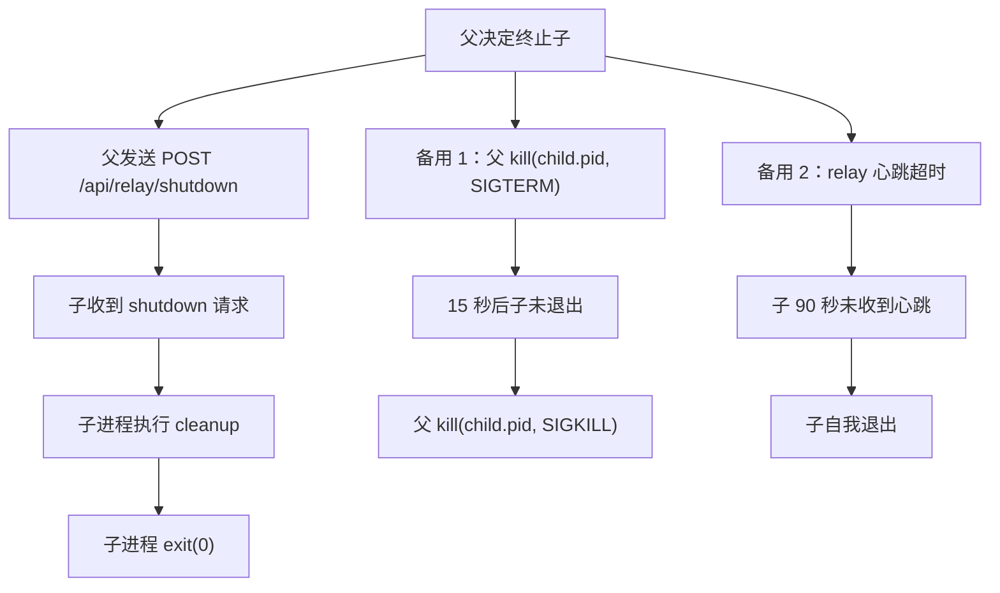
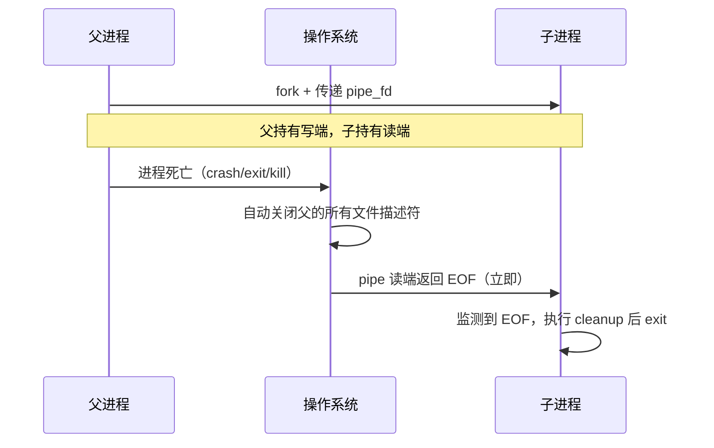
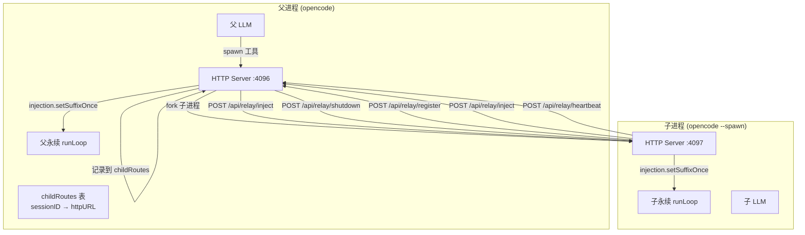
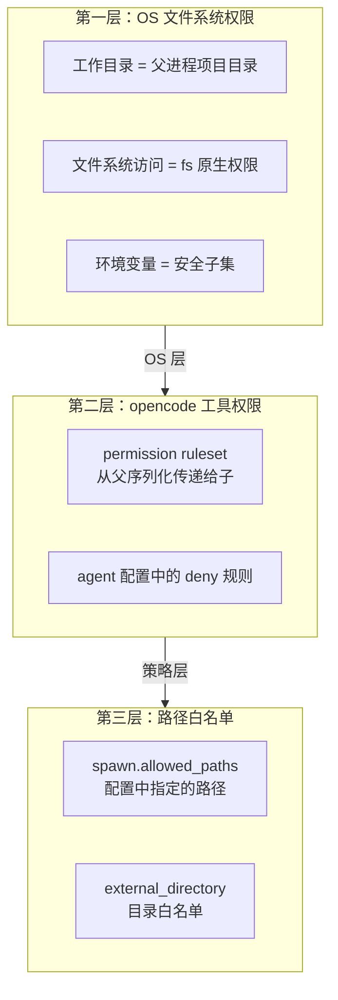
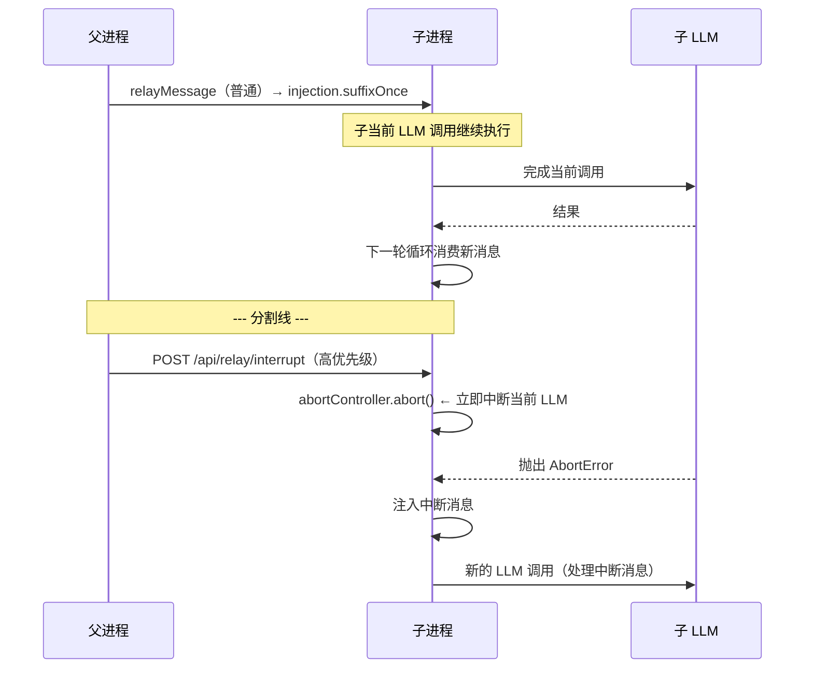

# Spawn 工具设计文档 v3

## 0. 核心生命周期问题

### Q1：父进程如何杀死子进程？

**三层终止机制：**



#### 1.1 协作终止（主路径）

子进程通过环境变量 `PARENT_HTTP_URL` 知道父的 HTTP 端口。

子进程的 relay handler 监听 `POST /api/relay/shutdown`：

```typescript
// 子进程 HTTP 端点
server.post("/api/relay/shutdown", (req) => {
  // 清理：dispose 条件引擎、关闭 relay 连接
  // 通知父"子已退出"
  fetch(`${parentHTTPURL}/api/relay/unregister`, {
    method: "POST",
    body: JSON.stringify({ sessionID: childSessionID }),
  }).catch(() => {})
  process.exit(0)
})
```

#### 1.2 信号终止（备用）

父进程在 spawn 时记录子 PID：

```typescript
const childPIDs = new Map<string, number>()

function killChild(sessionID: string) {
  const pid = childPIDs.get(sessionID)
  if (!pid) return

  // 先尝试 HTTP 协作终止
  fetch(`http://localhost:${childPort}/api/relay/shutdown`, { method: "POST" })
    .catch(() => {
      // 协作失败（子可能已卡死）
      if (process.platform === "win32") {
        Bun.spawnSync(["taskkill", "/F", "/PID", String(pid)])
      } else {
        process.kill(pid, "SIGTERM")
        setTimeout(() => { try { process.kill(pid, "SIGKILL") } catch {} }, 15000)
      }
    })

  childPIDs.delete(sessionID)
}
```

#### 1.3 心跳检测（自动清理）

子进程每 30 秒向父发 HTTP heartbeat。父 90 秒无心跳 → 判定死亡。

```typescript
// 父进程
server.post("/api/relay/heartbeat", (req) => {
  const { sessionID } = req.body
  heartbeats.set(sessionID, Date.now())
})

// 每 30 秒检查死亡
setInterval(() => {
  const now = Date.now()
  for (const [sid, last] of heartbeats) {
    if (now - last > 90000) {
      relayRoutes.delete(sid)
      heartbeats.delete(sid)
    }
  }
}, 30000)
```

```typescript
// 子进程：每 30 秒向父发心跳
let heartbeatFailures = 0
setInterval(() => {
  fetch(`${parentHTTPURL}/api/relay/heartbeat`, {
    method: "POST",
    body: JSON.stringify({ sessionID: childSessionID }),
  })
    .then(() => { heartbeatFailures = 0 })
    .catch(() => {
      heartbeatFailures++
      if (heartbeatFailures >= 3) {
        // 父进程可能已死，自我退出
        process.exit(1)
      }
    })
}, 30000)
```

---

### Q2：如何保证子进程生命周期 ≤ 父进程？

**核心方案：父进程死亡 → OS 立即通知子进程（而非 HTTP 轮询）。**

子进程不需要"主动检测"父是否死亡——操作系统会替它检测。关键是创建一个**父进程持有写端、子进程持有读端的管道**。父进程死亡时 OS 关闭文件描述符，子进程的读取立即返回 EOF。这是即时（微秒级）、零开销的检测。



#### 2.1 管道死亡监测（主方案）

```typescript
// 父进程 spawn 子时建立 pipe
const pipeFD = Bun.spawn([...], {
  // 不传任何数据给子进程 stdin
  // 而是通过额外传递的 fd 来实现
})
```

更可靠的实现：父进程向子进程传递**一个专用的 pipe 文件描述符**。子进程启动一个辅助线程/fiber 阻塞读取这个 pipe。父死 → pipe 断 → 读取返回 0 → 子进程立即 exit。

```typescript
// 父进程（spawn 工具执行时）
import { pipe } from "node:net"  // 或 Bun 的 pipe API

// 创建一对连通的 fd
const [readFD, writeFD] = Bun.pipe()

const child = Bun.spawn([...], {
  stdio: ["pipe", "pipe", "pipe"],
  // 将 readFD 作为额外 fd 传给子进程
  extra: { [3]: readFD },
  detached: true,
})

// 父进程持有 writeFD。父进程正常运行时，writeFD 保持打开。
// 父进程异常死亡时，OS 关闭 writeFD → readFD 读端收到 EOF
// 注意：writeFD 在子进程中永远不关闭，所以子进程读 readFD 会阻塞直到父死亡

// 父进程主动清理时关闭 writeFD 通知子
process.on("exit", () => { writeFD.close() })
```

```typescript
// 子进程入口
// 子进程启动后启动一个后台 fiber 监听 fd 3

import { read } from "node:fs"

// 在子进程的 init 中
function monitorParentDeath() {
  const buffer = new Uint8Array(1)
  // 阻塞读取 fd 3。父死亡时 read 返回 0（EOF）
  read(3, buffer, 0, 1, null, (bytesRead) => {
    if (bytesRead === 0) {
      // 父进程已死，立即退出
      logger.warn("parent process died, exiting")
      process.exit(0)
    }
  })
}
```

**为什么这比心跳好？**

| | 管道监测 | HTTP 心跳 |
|--|---------|----------|
| 延迟 | **微秒级**（OS 关 fd → 子 read 返回） | 15~90 秒（轮询间隔） |
| 父 crash 时 | ✅ OS 自动关 fd，无需任何代码 | ❌ 父无法发最后的心跳 |
| 父 kill -9 时 | ✅ OS 仍然关 fd | ❌ 父无法运行 exit handler |
| CPU 开销 | 零（子进程阻塞在 read） | 周期性 HTTP 请求 |
| 跨平台 | ❌ Windows 不支持 pipe 继承 | ✅ Windows 可用 |

**最佳方案：管道（主） + 心跳（备份）。** Windows 没有 pipe 继承机制，fallback 到心跳。

#### 2.2 Windows 方案

Windows 使用 Job Object：

```typescript
// Windows: 将子进程加入 Job Object，父死时 OS 自动终止 Job
// Bun 的 spawn 支持 windowsJob 选项
if (process.platform === "win32") {
  const child = Bun.spawn([...], {
    windowsJob: true,  // 父进程退出时自动 kill 子
    detached: true,
  })
}
```

#### 2.3 心跳备份（所有平台）

心跳作为跨平台的兜底方案（90 秒延迟）：

```typescript
// 子进程
let heartbeatFailures = 0
setInterval(() => {
  fetch(`${parentHTTPURL}/api/relay/heartbeat`, {
    method: "POST",
    body: JSON.stringify({ sessionID: childSessionID }),
  })
    .then(() => { heartbeatFailures = 0 })
    .catch(() => {
      if (++heartbeatFailures >= 3) process.exit(1)
    })
}, 30000)

// 子进程 max_lifetime 兜底
const maxLifetime = config.forever?.spawn?.max_lifetime_minutes ?? 1440
setTimeout(() => process.exit(0), maxLifetime * 60 * 1000)
```

#### 2.4 总防护矩阵

| 场景 | Unix (95%) | Windows (5%) |
|------|-----------|-------------|
| 父正常退出 | process.on("exit") 关 pipe → 子 read 立即返回 | Job Object 自动终止 |
| 父 crash (SIGSEGV) | OS 自动关 pipe fd → 子 read 返回 0 | OS 终止 Job Object |
| 父 kill -9 | OS 仍然关 fd → 子 read 返回 0 | OS 终止 Job Object |
| 父网络断开 | pipe 不受影响（同机） | 心跳 failure*3 后退出 |
| 所有平台兜底 | 心跳 90 秒超时 | 心跳 90 秒超时 |
| 最后防线 | max_lifetime（24h 默认） | max_lifetime（24h 默认） |

---

## 1. 定位

`spawn` 与 `task` 的职责边界：

| 维度 | `task` | `spawn` |
|------|--------|---------|
| 进程关系 | 同进程内子 session | **跨进程**新实例 |
| 循环 | 单次执行或 `background` 后台运行 | 全生命周期永续循环 |
| 通讯 | 结果返回值 | **HTTP 消息中继**，持续双向 |
| 权限 | 子 session 权限继承 | 子进程独立权限控制 |

**`spawn` 只做跨进程。同进程的归 `task`。**

---

## 2. 架构



### 协议总结

所有通信通过父子各自已有的 HTTP Server 完成。仅需 4 个新端点，全部挂载到现有 HTTP Server 上。

| HTTP 端点 | 方向 | 用途 |
|-----------|------|------|
| `POST /api/relay/register` | 子→父 | 子启动时向父注册自己的 sessionID 和 HTTP URL |
| `POST /api/relay/inject` | 双向 | 父→子 或 子→父 中继消息 |
| `POST /api/relay/heartbeat` | 子→父 | 子进程心跳 |
| `POST /api/relay/shutdown` | 父→子 | 父终止子进程 |

---

## 3. `spawn` 工具参数

```typescript
// packages/opencode/src/tool/spawn.ts

const Parameters = Schema.Struct({
  description: Schema.String.annotate({ description: "副本的任务描述" }),
  agent: Schema.String.annotate({ description: "副本使用的 subagent 类型" }),
  prompt: Schema.String.annotate({ description: "副本的初始提示词" }),
  forever_config: Schema.optional(Schema.Struct({
    conditions: Schema.optional(Schema.Struct({
      timer: Schema.optional(Schema.Struct({
        enabled: Schema.Boolean,
        interval_ms: Schema.Number,
      })),
      file_watch: Schema.optional(Schema.Struct({
        enabled: Schema.Boolean,
        paths: Schema.Array(Schema.String),
      })),
    })),
    prompt: Schema.optional(Schema.Struct({
      default: Schema.optional(Schema.String),
    })),
  })).annotate({ description: "永续配置。不提供则副本单次后退出" }),
  node: Schema.optional(Schema.String).annotate({
    description: "目标节点 'host:port'。留空同机启动新进程",
  }),
})

const Result = Schema.Struct({
  childSessionID: Schema.String,
  pid: Schema.optional(Schema.Number),
  message: Schema.String,
})
```

### 执行逻辑

```typescript
execute: (params, ctx) =>
  Effect.gen(function* () {
    const childAgent = yield* agents.get(params.agent)
    if (!childAgent) return fail("Unknown agent")
    if (childAgent.mode === "primary") return fail("Cannot spawn primary agent")

    // 1. 派生 session（权限不高于父）
    const childSession = yield* sessions.fork({ sessionID: ctx.sessionID })
    const childPermission = deriveSubagentSessionPermission({
      parentSessionPermission: ctx.permission ?? [],
      parentAgent: yield* agents.get(ctx.agent).pipe(Effect.option, Effect.map(o => o ?? undefined)),
      subagent: childAgent,
    })
    yield* sessions.setPermission({ sessionID: childSession.id, permission: childPermission })

    // 2. 构造子进程启动数据
    const childInit = {
      sessionID: childSession.id,
      agent: params.agent,
      prompt: params.prompt,
      permission: childPermission,
      forever_config: params.forever_config,
      parent: {
        sessionID: ctx.sessionID,
        httpURL: process.env["OPENCODE_HTTP_URL"] ?? "http://localhost:4096",
      },
    }

    // 3. 启动子进程
    if (params.node) {
      yield* startChildOnNode(params.node, childInit)
    } else {
      const child = Bun.spawn([
        process.argv[0], process.argv[1],
        "--spawn", JSON.stringify(childInit),
        "--port", String(findAvailablePort(4097)),
      ], { detached: true, env: { ...process.env, PARENT_HTTP_URL: childInit.parent.httpURL } })
      child.unref()
      childPIDs.set(childSession.id, child.pid)
    }

    return {
      childSessionID: childSession.id,
      pid: childPIDs.get(childSession.id),
      message: `副本已启动。Session: ${childSession.id}。使用 relayMessage 工具与其通信。`,
    }
  })
```

---

## 4. `relayMessage` 工具（LLM 可调用）

```typescript
// packages/opencode/src/tool/relay-message.ts

const Parameters = Schema.Struct({
  targetSessionID: Schema.String.annotate({ description: "目标副本的 sessionID" }),
  messages: Schema.String.annotate({ description: "消息内容（纯文本）" }),
})

export const RelayMessageTool = Tool.define("relayMessage", Effect.gen(function* () {
  return {
    description: "向指定的 spawn 副本发送消息。副本在下一轮循环中收到。",
    parameters: Parameters,
    execute: (params, ctx) =>
      Effect.gen(function* () {
        yield* relayInject({
          targetSessionID: params.targetSessionID,
          messages: [{ role: "user", content: params.messages }],
          mode: "suffix_once",
        })
        return {
          output: `消息已发送到副本 ${params.targetSessionID}`,
          title: "relayMessage",
          metadata: { target: params.targetSessionID },
        }
      }),
  }
}))
```

---

## 5. 权限控制体系

### 5.1 三层权限控制

spawn 子进程的权限分三个独立层面：



### 5.2 第一层：OS 级

```typescript
// 1. 工作目录锁定到父的项目目录
const child = Bun.spawn([...], {
  cwd: parentWorktree,  // 子无法 cd 到其他目录
})

// 2. 环境变量过滤 - 只传递安全变量
const childEnv: Record<string, string> = {}
const SAFE_KEYS = ["PATH", "HOME", "USER", "S_CODE_FOREVER",
  "PARENT_HTTP_URL", "OPENCODE_HTTP_URL"]
for (const key of SAFE_KEYS) {
  if (process.env[key]) childEnv[key] = process.env[key]!
}
```

### 5.3 第二层：工具权限

`deriveSubagentSessionPermission` 的输出序列化为 JSON 传给子进程。子进程启动时 `--spawn` 入口点将其加载到 session：

```typescript
yield* sessions.setPermission({
  sessionID: data.sessionID,
  permission: data.permission,
})
```

**关键：父进程的 deny 规则被原样序列化传递。** 如果父 deny 了 `bash`，子也 deny。

### 5.4 第三层：路径权限

路径控制通过 `external_directory` 和 `read` 权限的组合实现：

```json
// 子进程的 permission 示例
[
  { "permission": "*", "action": "deny", "pattern": "*" },

  { "permission": "read", "action": "allow", "pattern": "/home/user/project/**" },
  { "permission": "read", "action": "deny", "pattern": "**/.env" },
  { "permission": "read", "action": "deny", "pattern": "**/.ssh/**" },

  { "permission": "edit", "action": "deny", "pattern": "**" },
  { "permission": "edit", "action": "allow", "pattern": "/home/user/project/output/**" },

  { "permission": "external_directory", "action": "deny", "pattern": "*" },
]
```

路径匹配规则（复用 `Wildcard.match`）：
- `**` = 递归匹配任意路径
- `*` = 单层路径
- 多条同权限名规则，`findLast` 决定最终结果

### 5.5 spawn 参数中的路径白名单

```typescript
const Parameters = Schema.Struct({
  // ...
  allowed_paths: Schema.optional(Schema.Struct({
    read: Schema.optional(Schema.Array(Schema.String)),
    write: Schema.optional(Schema.Array(Schema.String)),
    external: Schema.optional(Schema.Array(Schema.String)),
  })).annotate({ description: "子进程允许访问的额外路径白名单" }),
})
```

### 5.6 权限安全性总结

| 威胁 | 防护 | 层级 |
|------|------|------|
| 读 `.env` | `read: "**/.env" → "deny"` | 第二层 |
| 写恶意文件 | `edit: "*" → "deny"` | 第二层 |
| 访问项目外 | `external_directory: "*" → "deny"` | 第二层 |
| 执行 shell | `bash: "deny"`（agent 配置） | 第二层 |
| 再派生 task | `task: "deny"`（由 deriveSubagentSessionPermission 自动添加） | 第二层 |
| 读父进程内存 | 独立 OS 进程 | 第一层 |
| 修改工作目录 | cwd 锁定，只限于父的项目 | 第一层 |

---

## 6. 子进程入口点

```typescript
// packages/opencode/src/cli/cmd/spawn.ts

export function spawnEntryPoint(data: {
  sessionID: string
  agent: string
  prompt: string
  permission: any
  forever_config?: any
  parent: { sessionID: string; httpURL: string }
}) {
  // 1. 向父注册
  fetch(`${data.parent.httpURL}/api/relay/register`, {
    method: "POST",
    body: JSON.stringify({ sessionID: data.sessionID, httpURL: process.env["OPENCODE_HTTP_URL"] }),
  })

  // 2. 设置永续模式
  setForeverMode()

  // 3. 注入初始提示词
  injection.setPrefix(data.sessionID, [
    { type: "text", text: data.prompt, synthetic: true },
  ])

  // 4. 启动永续循环
  loop({ sessionID: data.sessionID })

  // 5. 启动心跳
  startHeartbeat(data.parent.httpURL, data.sessionID)
}
```

---

## 6. 中断机制：父进程立即纠正子进程

### 6.1 问题

标准消息中继（`relayMessage`）是"追加式"的——消息被注入到子进程的下一轮循环。但如果子进程正在执行一个长的 LLM 调用或多个工具步骤，父进程无法**立即**阻止或纠正子。

例如：
- 子进程正在 `websearch` 搜索错误的词，父想让它立刻换关键词
- 子进程正在输出错误的分析，父想中断让它重新思考
- 子进程陷入了工具调用循环，父想强制终止

### 6.2 中断消息 vs 普通消息



### 6.3 新增端点

```typescript
// 子进程的 HTTP 端点

server.post("/api/relay/interrupt", (req) => {
  const { messages } = req.body  // OpenAI 标准消息

  // 1. 保存中断消息（优先级高于普通 suffix）
  interruptQueue.push(messages)

  // 2. 取消当前 LLM 调用
  if (currentAbortController) {
    currentAbortController.abort()
  }

  return { ok: true, interrupted: true }
})
```

### 6.4 子进程的 runLoop 接入

```typescript
// 子进程 runLoop 中（简化示意）
let interruptQueue: OpenAIMessage[][] = []
let currentAbortController: AbortController | null = null

while (true) {
  // 1. 检查中断队列
  if (interruptQueue.length > 0) {
    const interruptMessages = interruptQueue.shift()!
    // 将中断消息注入为当前循环的输入
    yield* injectInterruptMessages(interruptMessages)
    continue  // 跳过常规的 assistant finish 检查
  }

  // 2. 检查普通注入消息（原逻辑）
  const suffixParts = yield* injection.consumeSuffix(sessionID)
  // ... 正常循环逻辑 ...

  // 3. 调用 LLM（传入 AbortSignal）
  currentAbortController = new AbortController()
  const result = yield* callLLM({
    ...,
    abortSignal: currentAbortController.signal,
  })
  currentAbortController = null
}
```

### 6.5 父进程的中断工具

```typescript
// packages/opencode/src/tool/interrupt-child.ts

export const Parameters = Schema.Struct({
  targetSessionID: Schema.String.annotate({ description: "要中断的副本 sessionID" }),
  correction: Schema.String.annotate({ description: "纠正指令" }),
})

export const InterruptChildTool = Tool.define("interruptChild", Effect.gen(function* () {
  return {
    description: "立即中断副本当前动作，发送纠正指令。副本会抛弃当前 LLM 调用并立即处理新指令。",
    parameters: Parameters,
    execute: (params, ctx) =>
      Effect.gen(function* () {
        const childRoute = childRoutes.get(params.targetSessionID)
        if (!childRoute) return fail("副本未找到")

        yield* fetch(`${childRoute.httpURL}/api/relay/interrupt`, {
          method: "POST",
          body: JSON.stringify({
            messages: [{
              role: "user",
              content: [
                `<system-interrupt>`,
                `父进程发来纠正指令，请立即停止当前操作：`,
                ``,
                params.correction,
                `</system-interrupt>`,
              ].join("\n"),
            }],
          }),
        })

        return {
          output: `中断信号已发送到副本 ${params.targetSessionID}`,
          title: "interruptChild",
          metadata: { target: params.targetSessionID },
        }
      }),
  }
}))
```

### 6.6 消息优先级

| 优先级 | 消息类型 | 通道 | 处理时机 |
|--------|---------|------|---------|
| 🔴 最高 | **中断消息** | `POST /api/relay/interrupt` | 即时 - 取消当前 LLM 调用 |
| 🟡 中 | **轮次回调** | `onRoundComplete` | 每轮 LLM 完成后 |
| 🟢 低 | **普通注入** | `relayMessage` / `injection.suffix` | 下一轮循环开始前 |

---

## 7. 新增文件清单

| 文件 | 内容 | 行数 |
|------|------|------|
| `packages/opencode/src/tool/spawn.ts` | spawn 工具 | ~120 |
| `packages/opencode/src/tool/relay-message.ts` | relayMessage 工具 | ~50 |
| `packages/opencode/src/forever/relay.ts` | 中继引擎（路由表 + 消息转发 + 心跳 + shutdown） | ~120 |
| `packages/opencode/src/cli/cmd/spawn.ts` | `--spawn` 入口 | ~60 |
| **合计** | | **~350** |

### 修改文件

| 文件 | 改动 |
|------|------|
| `packages/opencode/src/tool/registry.ts` | 注册 `spawn` + `relayMessage` |
| `packages/opencode/src/server/routes/` | 新增 `/api/relay/*` 路由 |
