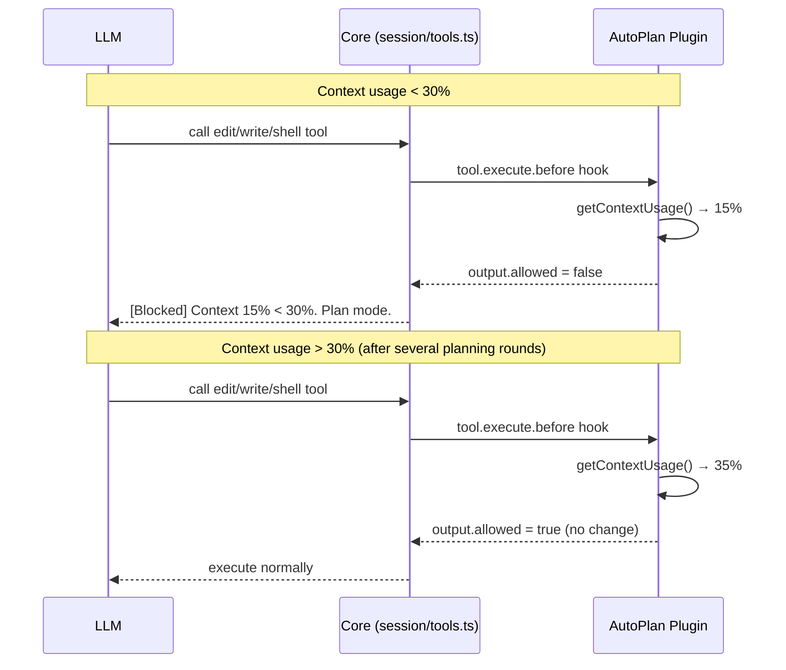

# 强制 Plan 模式直到 Context 占用超过 30% — 可行性分析报告

## 1. 需求概述

> 以 plan 模式启动，强制无法调用任何编辑工具，直到上下文占用超过 30%。

核心要素：
1. **启动后** — 编辑工具（`edit`、`write`、`apply_patch`、`shell`）被禁止，只允许只读工具
2. **条件解除** — 当 Context 窗口占用率 > 30% 时，编辑工具自动解除封锁
3. **不切换 agent** — 保持同一个 agent，避免 system prompt 变化

## 2. 现有机制分析

### 2.1 Plan Mode 权限机制

**Agent 定义**（[`packages/opencode/src/agent/agent.ts:144-166`](packages/opencode/src/agent/agent.ts:144-166)）

```typescript
plan: {
  permission: Permission.merge(
    defaults,
    Permission.fromConfig({
      edit: {
        "*": "deny",
        [path.join(".opencode", "plans", "*.md")]: "allow",
      },
    }),
  ),
}
```

Plan agent 通过 **permission 规则**禁止编辑工具，同时通过 **system prompt**（[`plan-mode.txt`](packages/opencode/src/session/prompt/plan-mode.txt)、[`plan.txt`](packages/opencode/src/session/prompt/plan.txt)）告诉 LLM "不得编辑"。

**动态切换的障碍**：切换 agent 会同时改变 permission 和 system prompt，而后者不是我们想要的。

### 2.2 Context 占用跟踪

**Token 使用量计算**（[`packages/opencode/src/session/session.ts:390-459`](packages/opencode/src/session/session.ts:390-459)）

每次 LLM 响应后，`getUsage()` 计算 input/output/cache 的 token 用量，存储在 `Assistant.tokens` 中。

**Overflow 检测**（[`packages/opencode/src/session/overflow.ts:21-33`](packages/opencode/src/session/overflow.ts:21-33)）

```typescript
export function isOverflow(input: { tokens; model }) {
  const count = tokens.total || ...
  return count >= usable(input)  // 是否超过可用上限
}
```

**局限**：
- 只有二进制溢出判断（超过 vs 未超过）
- 缺少**百分比占用率**查询
- `isOverflow` 是纯函数，但没有暴露为 Effect Service 供外部调用

### 2.3 Plugin 系统能力边界

**Hook 类型**（[`packages/plugin/src/index.ts:222-383`](packages/plugin/src/index.ts:222-383)）

| Hook | 可阻断工具？ | 可获取 Context？ | 参与 Tool 定义？ |
|------|-------------|-----------------|-----------------|
| `tool.execute.before` | ❌ 返回值 `void` | ❌ 无 token 字段 | ❌ |
| `tool.execute.after` | ❌ 已执行完 | ❌ | ❌ |
| `tool.definition` | ❌ 只能改描述 | ❌ | ✅ |
| `permission.ask` | ✅ 可设为 deny | ❌ | ❌ |
| `loop.continue` | N/A | ❌ 无 token 字段 | ❌ |
| `chat.message` | N/A | ❌ | ❌ |

**关键缺失**：
- 没有任何 hook 的 input 中包含 **token 使用量**或 **context 限制**
- `tool.execute.before` 的 output 是 `void`，**无法影响工具执行流程**
- 没有暴露 **context 占用百分比查询接口**给插件

## 3. 核心结论：纯插件实现不可行

| 缺失能力 | 原因 |
|---------|------|
| **Context 占用率不可获取** | 所有 plugin hook 的 input 均不含 token/usage/contextLimit |
| **无法阻断工具执行** | `tool.execute.before` 返回值 void，不能阻止工具运行 |
| **Context 查询接口未暴露** | `overflow.ts` 的函数是纯函数，未通过 Effect Service 或 PluginInput 暴露 |

需要 **Core 层的 3 项最小改动** + Plugin 实现。

---

## 4. 推荐方案：不切换 Agent，只控制 Tool Permission

### 4.1 核心思路

```
                   Core 层                               Plugin 层
               ┌─────────────┐                ┌────────────────────────┐
               │  暴露 context │◄────API──────►│  每次 tool.execute     │
               │  查询接口    │                │  .before 检查 context  │
               └─────────────┘                │  占比是否 > 30%       │
                      ↑                        │                      │
               ┌─────────────┐                │  < 30% → blocked      │
               │  增强 hook   │◄────input────►│  > 30% → allowed      │
               │  output 类型 │                └────────────────────────┘
               └─────────────┘
```

- **不切换 agent** — LLM 始终使用同一个 agent，system prompt 不变
- **Plugin 在 tool 执行前检查** — 低于阈值时返回拦截结果
- **只读工具不受影响** — `grep`、`glob`、`read`、`question` 等永远允许

### 4.2 核心交互流程



### 4.3 Core 层改动

#### 改动 1：增强 `tool.execute.before` Hook 的 Output 类型

**文件**: [`packages/plugin/src/index.ts:266-269`](packages/plugin/src/index.ts:266-269)

```typescript
"tool.execute.before"?: (
  input: { tool: string; sessionID: string; callID: string },
  output: {
    args: any
    /** +++ 新增：是否允许工具继续执行，默认 true +++ */
    allowed?: boolean
    /** +++ 新增：阻断原因，LLM 会看到此消息 +++ */
    blockReason?: string
  },
) => Promise<void>
```

#### 改动 2：处理阻断逻辑

**文件**: [`packages/opencode/src/session/tools.ts:102-126`](packages/opencode/src/session/tools.ts:102-126)

在 `tool.execute.before` trigger 之后，增加允许性检查：

```typescript
yield* plugin.trigger(
  "tool.execute.before",
  { tool: item.id, sessionID: ctx.sessionID, callID: ctx.callID },
  { args, allowed: true },  // ← 默认 allowed=true
)

// +++ 新增：检查插件是否要求阻断 +++
// 由于 plugin.trigger 直接修改 output 对象，需要在 trigger 后检查
// 通过 Effect 机制，trigger 返回的 output 已包含插件修改后的值
// 但需要修改 trigger 的返回语义，或者通过 output 对象的引用检查

// 更简单的做法：在 execute closure 内直接检测 output 的引用变化
// 但目前的 plugin.trigger 签名是 (name, input, output) => Effect<Output>
// output 是传引用，插件修改后返回，所以可以直接用
```

由于目前的 [`plugin.trigger`](packages/opencode/src/plugin/index.ts:286-299) 返回 `Output` 对象（同一个引用），可以对返回结果做检查：

```typescript
const checkOutput = yield* plugin.trigger(
  "tool.execute.before",
  { tool: item.id, sessionID: ctx.sessionID, callID: ctx.callID },
  { args, allowed: true, blockReason: "" },
)
if (checkOutput.allowed === false) {
  return {
    title: "Tool blocked",
    output: checkOutput.blockReason ?? "This tool is currently blocked by policy.",
    metadata: {
      intercepted: {
        rule: "plugin_threshold",
        reason: checkOutput.blockReason ?? "Blocked",
      },
    },
  }
}
```

#### 改动 3：暴露 Context 占用查询 API

**文件**: 新增或修改 [`packages/opencode/src/session/session.ts`](packages/opencode/src/session/session.ts)

在 `Session.Service` 中新增方法：

```typescript
export interface Interface {
  // ... 现有方法 ...

  /** 获取当前 session 的 context 占用信息 */
  readonly contextUsage: (sessionID: SessionID) => Effect.Effect<{
    usedTokens: number
    contextLimit: number
    percentage: number  // 0-1
  } | null>
}
```

实现：

```typescript
const contextUsage: Interface["contextUsage"] = Effect.fn("Session.contextUsage")(function* (sessionID) {
  const msgs = yield* MessageV2.filterCompactedEffect(sessionID).pipe(
    Effect.provideService(Database.Service, database),
  )
  const lastAssistant = msgs.findLast((m) => m.info.role === "assistant")
  if (!lastAssistant?.info.tokens) return null
  
  const tokens = lastAssistant.info.tokens
  const total = tokens.total || tokens.input + tokens.output + tokens.cache.read + tokens.cache.write
  
  // 获取 model 的 context 限制
  const model = yield* provider.getModel(
    lastAssistant.info.providerID as ProviderV2.ID,
    lastAssistant.info.modelID as ProviderV2.ModelID,
  ).pipe(Effect.option)
  if (Option.isNone(model)) return null
  
  const contextLimit = model.value.limit.context
  if (contextLimit === 0) return null
  
  return {
    usedTokens: total,
    contextLimit,
    percentage: total / contextLimit,
  }
})
```

然后通过 PluginInput 暴露给插件（或通过 `client` SDK 暴露）：

```typescript
// 在 plugin/index.ts 的 input 构造中
const input: PluginInput = {
  client,
  project: ctx.project,
  // ... 现有字段 ...
  // +++ 新增 +++
  experimental: {
    contextUsage: (sessionID: string) =>
      bridge.promise(contextUsage(sessionID as SessionID)),
  },
}
```

### 4.4 Plugin 实现

```typescript
// packages/opencode/src/plugin/auto-plan.ts
import type { Hooks, PluginInput } from "@opencode-ai/plugin"

export default function autoPlanPlugin(input: PluginInput): Hooks {
  const editTools = new Set(["edit", "write", "apply_patch", "shell"])
  let thresholdMet = false

  return {
    "tool.execute.before": async (input, output) => {
      if (thresholdMet) return  // 已达标，放行所有工具

      if (editTools.has(input.tool)) {
        try {
          // 通过 client API 或 experimental 接口查询
          const usage = await input.client.queryContextUsage(input.sessionID)
          // 或者通过 experimental.contextUsage(sessionID)
          
          if (usage && usage.percentage <= 0.3) {
            output.allowed = false
            output.blockReason = [
              `[Blocked by auto-plan]`,
              `Context usage is ${(usage.percentage * 100).toFixed(1)}%, below the 30% threshold.`,
              `You are in plan mode: gather information and build a plan first.`,
              `Only read-only tools (read, grep, glob, question) are available until`,
              `context usage exceeds 30%.`,
            ].join("\n")
            return
          }
        } catch {
          // 查询失败时默认允许
        }
        
        thresholdMet = true
      }
    },
  }
}
```

### 4.5 PluginInput 类型更新

**文件**: [`packages/plugin/src/index.ts:56-66`](packages/plugin/src/index.ts:56-66)

```typescript
export type PluginInput = {
  client: ReturnType<typeof createOpencodeClient>
  project: Project
  directory: string
  worktree: string
  experimental_workspace: { ... }
  serverUrl: URL
  $: BunShell
  // +++ 新增：实验性 API +++
  experimental?: {
    contextUsage?: (sessionID: string) => Promise<{
      usedTokens: number
      contextLimit: number
      percentage: number
    } | null>
  }
}
```

### 4.6 更简洁的替代方案：纯 Core 实现（不依赖 Plugin）

如果用户不希望依赖 plugin 机制，也可以在 core 层直接实现：

```typescript
// 在 session/tools.ts 中，无需 plugin hook
const planModeConfig = yield* config.get().pipe(
  Effect.map(cfg => cfg.experimental?.autoPlanUntilContextThreshold),
)

if (planModeConfig && !planModeConfig.disabled) {
  const editTools = new Set(["edit", "write", "apply_patch", "shell"])
  if (editTools.has(item.id)) {
    const usage = yield* contextUsage(ctx.sessionID)
    const threshold = planModeConfig.threshold ?? 0.3
    if (usage && usage.percentage <= threshold) {
      return {
        title: "Tool blocked (auto-plan mode)",
        output: `[Blocked] Context usage ${(usage.percentage * 100).toFixed(0)}% is below ${(threshold * 100).toFixed(0)}% threshold. Gather more information first.`,
        metadata: { intercepted: { rule: "auto_plan", reason: "Context threshold not met" } },
      }
    }
  }
}
```

但这样不够灵活。用户可能需要自定义阈值、控制哪些工具被限制等。

---

## 5. 综合评估

| 方案 | 优点 | 缺点 | Core 改动量 | 推荐 |
|------|------|------|------------|------|
| **纯 Plugin** | 无 Core 改动 | ❌ **不可行** | 0 | ❌ |
| **Plugin + Core 增强** | 灵活、可配置、可替换 | 需要 3 个 Core 改动 | 小 | ✅ **推荐** |
| **纯 Core 实现** | 简单直接 | 不可扩展、硬编码 | 中 | ⚠️ 备选 |

### 推荐方案 Core 改动清单

| 编号 | 文件 | 改动内容 | 行数 |
|------|------|---------|------|
| 1 | [`packages/plugin/src/index.ts:266-269`](packages/plugin/src/index.ts:266-269) | `tool.execute.before` output 增加 `allowed?` / `blockReason?` | +3 |
| 2 | [`packages/opencode/src/session/tools.ts:102-126`](packages/opencode/src/session/tools.ts:102-126) | trigger 后检查 `output.allowed`，返回拦截结果 | +15 |
| 3 | [`packages/opencode/src/session/session.ts`](packages/opencode/src/session/session.ts) | 新增 `contextUsage()` 方法暴露 context 占用率 | +30 |
| 4 | [`packages/plugin/src/index.ts:56-66`](packages/plugin/src/index.ts:56-66) | PluginInput 新增 `experimental.contextUsage` | +6 |
| 5 | [`packages/opencode/src/plugin/index.ts`](packages/opencode/src/plugin/index.ts) | 构造 PluginInput 时注入 `contextUsage` | +8 |

### Plugin 层文件

| 编号 | 文件 | 说明 |
|------|------|------|
| 1 | `packages/opencode/src/plugin/auto-plan.ts` | 自动 plan plugin 实现 |
| 2 | `packages/opencode/src/plugin/index.ts` | 注册 auto-plan 为内置 plugin |

---

## 6. 边界情况与风险

### 6.1 Context 计算时机

Token 使用量在 LLM **响应之后**才更新。所以：
- 第一轮：0% → LLM 发送只读消息 → tokens 更新
- 第二轮：x% → LLM 尝试调用编辑工具 → plugin 检查 → 可能仍低于 30%
- 检测存在**一轮滞后**，但这对单调递增的累积 token 用量的影响很小

### 6.2 阈值配置

建议在 `opencode.json` 中配置：

```json
{
  "plugin_origins": ["packages/opencode/src/plugin/auto-plan.ts"],
  "auto_plan": {
    "enabled": true,
    "context_threshold": 0.3,
    "blocked_tools": ["edit", "write", "apply_patch", "shell"]
  }
}
```

### 6.3 LLM 对阻断的反应

当 LLM 调用编辑工具被拒绝时，它会收到 `[Blocked]` 输出。LLM 需要理解：
1. 当前在 plan 模式，不能修改文件
2. 需要继续使用只读工具收集信息
3. 当 context 足够满时，编辑工具会自动解禁

对应的 `blockReason` 文本需要清晰传达这一点。

### 6.4 持久化

- `thresholdMet` 状态在 process 内存中，重启后会丢失
- 对于短暂 session 这不是问题
- 如需持久化，可以将标记写入 session metadata

---

## 7. 实施 TODO

### Core 层
- [ ] 增强 [`packages/plugin/src/index.ts`](packages/plugin/src/index.ts:266-269) 的 `tool.execute.before` output 类型，增加 `allowed`/`blockReason` 字段
- [ ] 在 [`packages/opencode/src/session/tools.ts`](packages/opencode/src/session/tools.ts:102-126) 中增加 `output.allowed === false` 的分支处理
- [ ] 在 [`packages/opencode/src/session/session.ts`](packages/opencode/src/session/session.ts) 中新增 `contextUsage()` 方法
- [ ] 在 [`packages/opencode/src/plugin/index.ts`](packages/opencode/src/plugin/index.ts) 的 PluginInput 中注入 `contextUsage`

### Plugin 层
- [ ] 在 `packages/opencode/src/plugin/` 下创建 `auto-plan.ts`
  - 状态管理：`thresholdMet` flag（memory 级别）
  - `tool.execute.before` hook：检查 context 占比，阻断编辑工具
- [ ] 在 [`packages/opencode/src/plugin/index.ts`](packages/opencode/src/plugin/index.ts) 的 `internalPlugins()` 中注册 auto-plan plugin

### 配置
- [ ] 支持通过 `opencode.json` 配置 context_threshold 和 blocked_tools 列表

### 测试
- [ ] 验证 context < 30% 时编辑工具被阻断，只读工具正常
- [ ] 验证 context > 30% 后编辑工具自动放行
- [ ] 验证阈值可配置
- [ ] 验证多轮对话累计 token 不报错
- [ ] 验证边缘情况：context_limit=0、无 assistant 消息
